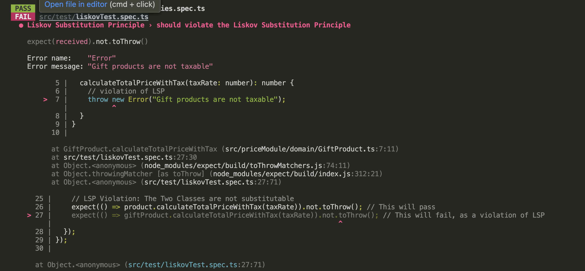
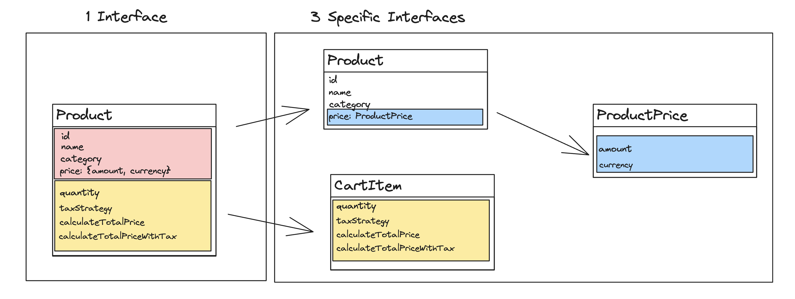

# Action Item: SOLID principles 💊

The **SOLID** principles help us write code that can be easily extended and maintained.


#### 🎯 Single Responsability Principle

> "A `class` should have only **one reason to change**" - Clean Code

or "each piece of code should have only **one responsibility**"

#### 🔒 Open/Closed Principle

> "Software entities (classes, modules, functions, and so on) should be **open for extension, but closed for modification**" - Clean Code

of "code should be designed in a way that **allows new features to be added without modifying existing code.**"

#### 🔄 Liskow Substitution Principle

> "...an object (such as a class) may be replaced by a sub-object (such as a class that extends the first class) without breaking the program"

or substituting one module or piece of code with another should not break the behavior or functionality of the program.

#### 🧩 Interface Segregation

> "Clients should not be forced to depend upon interfaces that they do not use." - Clean Code

of "avoid creating large, monolithic functions/objects/classes/interfaces that contain many unrelated methods or properties."

#### 🔗 Dependency Inversion Principle

> "Depend upon abstractions, [not] concretions." - Clean Code

or "code should **depend on higher-level concepts rather than specific implementations**".

## Tasks:

1. [ ] 1. Apply the **Single Responsibility Principle** to split the code in [src/calculateTotalPricePerCategory.ts](/src/calculateTotalPricePerCategory.ts) into `modules` that will evolve independently.

2. [ ] 2. Apply the **Open/Closed Principle** to allow developers to add new `discount` rules without modifying the `calculateDiscount` function.

3. [ ] 3. Apply **Liskov Substitution** to the `Product` class and its children.

4. [ ] 4. Apply **Interface Segregation** to the `Product` class in order to avoid unnecessary coupling.

5. [ ] 5. Make code more reusable and reduce `coupling` by applying **Dependency Inversion** to our `Product Class`.

---

<details closed>
<summary>CLICK ME! - 🛠️ ACTION ITEM SETUP</summary>

### 🛠️ Setup

1. Install dependencies 📦

```
npm install
```

2. Run the `tests` ✅

```
npm test
```

You should see this in your terminal:


3. Run the program 🚀

```
npm start
```

You should see this in your terminal:


</details>

---

### 📚 Walkthrough

---

<details closed>
<summary>CLICK ME! - TASK 1 -  🎯 Single Responsibility Principle</summary>

#### TASK 1 - Single Responsibility Principle

Apply the **Single Responsibility Principle** to split the code in [src/calculateTotalPricePerCategory.ts](/src/calculateTotalPricePerCategory.ts) into `functions/modules` that can change and evolve independently.

> "A class should have only one reason to change" - Clean Code

##### Applying this principle well will prevent unexpected secondary effects of code changes in the future.

To do so you need to identify the possible **sources of change** in the code. The most typical are:

- changes in the input shape
- changes in the output requirements
- changes in the logic(control flow)

In our case, after reading the [calculateTotalPricePerCategory.ts](/src/calculateTotalPricePerCategory.ts) function we have identified a couple of **SOURCES OF CHANGE**:

- the way we `extract categories` from the product list might change because the product list shape might change

- the way `discounts` are calculated for a product might change due to business requirements

- the way `tax` is applied might change and the tax rate might change also

To minimize the changes needed in the code to accommodate changes in requirements we will split the original function into smaller ones that address each problem individually.

Try to do this yourself to the best of your ability.


Advantages of the new structure:

- clear module and function boundaries
- the possibility of testing each function individually

### Solution:

- **💊 Solution Code: `git checkout feature/single-responsibility-principle`**
- **🎥 Solution Video: [Click Here For The Video Solution](https://www.loom.com/share/8809526da2324c9ca997d9d34e873b31)**

</details>

---

<details closed>
<summary>CLICK ME! - TASK 2 - 🔒 Open/Closed Principle</summary>

#### TASK 2 - Open/Closed Principle

Before we start, checkout on the solution branch from the previous exercise or follow your own code if you ended up with a similar structure:

```bash
git checkout task_two_open_closed_start
```

###### Open/Closed Principle

> > "Software entities (classes, modules, functions, and so on) should be **open for extension, but closed for modification**" - Clean Code

In the case of our original discount function:

```typescript
import { Product } from "../types";

// SOURCE OF CHANGE: We want to add a new discount rule
export default function calculateDiscout(product: Product) {
  let discount = 0;
  if (product.quantity > 10) {
    // 10% discount if we buy more than 10
    discount = 0.1;
  } else if (product.quantity > 5) {
    // 5% discount if we buy more than 5
    discount = 0.05;
  } else if (product.quantity > 1) {
    // 0% discount if we buy more than 1
    discount = 0;
  }
  return discount;
}
```

##### We want to find a way to be able to add new discount rules without having to change the code of the `calculateDiscout` function.

🧠 Try and think about this for a couple of minutes.

Hmmm...

🙋🏽 What if we can provide the rules as an `array` of `objects` containing the `quantity` and the `discount` amount?

We can afterward use a `for` loop to find the rule that has to be applied depending on the `quantity`.

To do so, in [calculateDiscount.ts](src/priceModule/calculateDiscount.ts) :

1. Add an `interface` for `DiscountRules`

```typescript
interface DiscountRule {
  quantity: number;
  discount: number;
}
```

2. Extract the `rules` to the [config](src/priceModule/config.ts) file in this `module`

```typescript
export const DISCOUNT_RULES = [
  {
    quantity: 10,
    discount: 0.1,
  },
  {
    quantity: 5,
    discount: 0.05,
  },
  {
    quantity: 1,
    discount: 0,
  },
];
```

3. Update the code to use the `rules` array

```typescript
// The rules array is passed as an argument to the calculateDiscount function
function calculateDiscountBasedOnRules(
  product: Product,
  rules: DiscountRule[]
) {
  // Sort rules by quantity in descending order
  const sortedRules = [...rules].sort((a, b) => b.quantity - a.quantity);

  for (let rule of sortedRules) {
    if (product.quantity > rule.quantity) {
      // Apply the first matching rule
      return rule.discount;
    }
  }

  // No rule matched, return 0
  return 0;
}
```

4. Apply the `rules` array to the exported version of the function so our clients(whoever is using this function) are not affected

```typescript
export default function calculateDiscount(product: Product) {
  return calculateDiscountBasedOnRules(product, DISCOUNT_RULES);
}
```

###### We can now extend the `calculateDiscount` behavior without changing the `caculateDiscoutBasedOnRules` function - so we can say the function is `Open for extension` and at the same time `Closed for modification`.

### Solution:

- **🧪 Solution Code: `git checkout task_two_open_closed_end`**
- **🎥 Solution Video: [Click Here For The Video Solution](https://www.loom.com/share/da8e4c4c61624812aa01734ad674da5e)**

</details>

---

<details closed>
<summary>CLICK ME! - TASK 3 - 🔄 Liskov Substitution</summary>

#### TASK 3 - Liskov Substitution

> "...an object (such as a class) may be replaced by a sub-object (such as a class that extends the first class) without breaking the program"

To illustrate this we will use `classes` for our products and move the relevant logic to class methods.

1. Before we start, check out the following branch:

```bash
git checkout liskow_substitution_principle_start
```

2. Run the tests to see the violation of the `LSP`:

```bash
npm test
```

You should see something like this:


#### ⚠️ Violation of **Liskov Substitution**:

> `GiftProduct` cannot be used in the code instead of its parent class(super object) because it will result in errors thrown when the `calculateTotalPriceWithTax` method is called.

3. Fix the violation of `LSP`. We can do this in two different ways:

- make sure the child does not break any behavior of the parent
- prefer **Composition over Inheritance** to keep `inheritance chains` small

Before we head to the solution, go to [src/priceModule/domain](src/priceModule/domain) and check out our new `classes`:

```typescript
// Product Class
export class Product {
  public id: number;
  public name: string;
  public category: ProductCategory;
  public quantity: number;
  public price: {
    amount: number;
    currency: string;
  };

  constructor(
    id: number,
    name: string,
    category: ProductCategory,
    quantity: number,
    price: { amount: number; currency: string }
  ) {
    this.id = id;
    this.name = name;
    this.category = category;
    this.quantity = quantity;
    this.price = price;
  }

  calculateTotalPrice(): number {
    return this.price.amount * this.quantity;
  }

  calculateTotalPriceWithTax(taxRate: number): number {
    return this.calculateTotalPrice() * (1 + taxRate);
  }
}
```

And an example of a `class` that inherits from `Product`, is the `GiftProduct`:

```typescript
// GIFT PRODUCT cannot be used in place of Product
export class GiftProduct extends Product {
  private isTaxable = true;
  calculateTotalPriceWithTax(taxRate: number): number {
    // violation of LSP
    throw new Error("Gift products are not taxable");
  }
}
```

### Solving the `LSP` violation:

#### Solution #1

In our case, because we use `TypeScript` we ensure that at least from the shape perspective the children's classes will comply with the `interface` of the `parent class`. However, we can still break `LSP` with behavior, like throwing `exceptions`. To avoid it we need to:

1. Avoid throwing `errors` in `child classes` that `parent classes` do not throw. In this class case, we can just return 0 instead. In [GiftProduct](src/priceModule/domain/GiftProduct.ts):

```typescript
import Product from "./Product";

export default class GiftProduct extends Product {
  private isTaxable = false;

  calculateTotalPriceWithTax(taxRate: number): number {
    // Behaves like the parent class ✅✅✅
    // Rather than throw an error, just ignore the tax for gift products
    if (this.isTaxable) {
      return super.calculateTotalPriceWithTax(taxRate);
    } else {
      // If the product is not taxable, return the total price without tax
      return this.calculateTotalPrice(); // 🎉 Test Passed! 🎉
    }
  }
}
```

##### Solution #1

- **🧪 Solution Code: `git checkout liskow_substitution_principle_solution_one`**
- **🎥 Solution Video: [Click Here For The Video Solution](https://www.loom.com/share/a98c98203ad44a77873c5c72d977bc2b)**

#### Solution #2

2. Prefer **Composition Over Inheritance** - this is something frameworks like `React` adopted to avoid problems that come from having long inheritance chains(like the violation of `LSP`).

Instead of inheriting the tax application behavior, we will add it to our objects at build time. We will use an extra building block to encapsulate the tax logic. In the `domain` folder, create a new file, `TaxStrategy`:

```typescript
import { TAX_RATE } from "../config";

export interface TaxStrategy {
  calculateTax(amount: number): number;
}

export class StandardTaxStrategy implements TaxStrategy {
  calculateTax(amount: number): number {
    return amount * TAX_RATE;
  }
}

export class NonTaxableStrategy implements TaxStrategy {
  calculateTax(amount: number): number {
    return 0;
  }
}
```

Our new `Product` class will look like this:

```diff
import { ProductCategory } from "../../types";
+import { TaxStrategy } from "./TaxStrategy";

export default class Product {
  public id: number;
  public name: string;
  public category: ProductCategory;
  public quantity: number;
  public price: {
    amount: number;
    currency: string;
  };
+ private taxStrategy: TaxStrategy;

  constructor(
    id: number,
    name: string,
    category: ProductCategory,
    quantity: number,
    price: { amount: number; currency: string },
    taxStrategy: TaxStrategy
  ) {
    this.id = id;
    this.name = name;
    this.category = category;
    this.quantity = quantity;
    this.price = price;
+   this.taxStrategy = taxStrategy;
  }

  calculateTotalPrice(): number {
    return this.price.amount * this.quantity;
  }

  calculateTotalPriceWithTax(): number {
+   const tax = this.taxStrategy.calculateTax(this.calculateTotalPrice());
    return this.calculateTotalPrice() + tax;
  }
}
```

NOTE: We can create new variations of `Product` with **Composition** rather than inheriting from the parent class. In [GiftProduct.ts](src/priceModule/domain/GiftProduct.ts) remove the class and add:

```typescript
import { ProductCategory } from "../../types";
import Product from "./Product";
import { NonTaxableStrategy, StandardTaxStrategy } from "./TaxStrategy";

// Composition Over Inheritance
const regularProduct = new Product(
  1,
  "Regular Product",
  ProductCategory.FOOD,
  2,
  { amount: 100, currency: "USD" },
  new StandardTaxStrategy()
);

const giftProduct = new Product(
  2,
  "Gift Product",
  ProductCategory.FOOD,
  2,
  { amount: 100, currency: "USD" },
  new NonTaxableStrategy()
);
```

###### ❗❗ We will have to update all our tests because the way we build the `Product` class changed. ❗❗

You can try that yourself or check out our solution:

```bash
git checkout liskow_substitution_principle_solution_two
```

Feel free to implement any of the solutions above. We recommend you try this in any codebase you are working with to make sure you fixate on the concept.

> In modern JavaScript frameworks like `React` or `Vue`, the principle of **composition over inheritance** is widely embraced. This approach promotes building components by composing smaller, reusable pieces of functionality rather than relying heavily on class inheritance hierarchies. By favoring composition, these frameworks offer flexibility, reusability, simplification, and separation of concerns.
> `Components` are created by combining smaller components together, allowing for modular and scalable designs. `React` and `Vue` exemplify this principle through their component-based architectures, declarative syntax, and support for reusable building blocks.

#### Solution #2 - Composition Over Inheritance

- **🧪 Solution Code: `git checkout liskow_substitution_principle_solution_two`**
- **🎥 Solution Video: [Click Here For The Video Solution](https://www.loom.com/share/f20a1bea331646399f847bfac9d2066f)**

📝 NOTE: Run the tests to make sure you fixed the `LSP` violation.

</details>

---

<details closed>
<summary>CLICK ME! - TASK 4 - 🧩 Interface Segregation</summary>

### TASK 4 - Interface Segregation

> "Clients should not be forced to depend upon interfaces that they do not use." - Clean Code

To make this principle simple you can say:

> "Aa class should not be forced to implement interfaces it doesn't use. Instead of one big interface, many small interfaces are preferred based on groups of methods, each one serving one submodule."

1. Before we start, check out the following branch:

```bash
git checkout interface_segregation_start
```

This principle is a bit abstract but we can easily understand it with our `Product` class:

```typescript
import ProductCategory from "./ProductCategory";
import { TaxStrategy } from "./TaxStrategy";

export default class Product {
  public id: number;
  public name: string;
  public category: ProductCategory;
  public quantity: number;
  public price: {
    amount: number;
    currency: string;
  };
  private taxStrategy: TaxStrategy;

  constructor(
    id: number,
    name: string,
    category: ProductCategory,
    quantity: number,
    price: { amount: number; currency: string },
    taxStrategy: TaxStrategy
  ) {
    this.id = id;
    this.name = name;
    this.category = category;
    this.quantity = quantity;
    this.price = price;
    this.taxStrategy = taxStrategy;
  }

  calculateTotalPrice(): number {
    return this.price.amount * this.quantity;
  }

  calculateTotalPriceWithTax(): number {
    const tax = this.taxStrategy.calculateTax(this.calculateTotalPrice());
    return this.calculateTotalPrice() + tax;
  }
}
```

Whoever wants information about the `Product` also ends up consuming the `quantity` property, which is only relevant for certain use-cases. If we just want to display a list of products or an individual product, the `quantity` is irrelevant.

##### Applied Interface Segregation Principle

If we apply the `Interface Segregation Principle` we will end up with smaller classes that deal with specific behaviors.

> :bell: **Reminder**: Every `class` in `TypeScript` inherently defines an `interface`. This `interface` includes all the public members of the class - properties, methods, etc. This makes TypeScript's class mechanics and type system very flexible and powerful because you can use these implicit interfaces in type annotations just like explicit interfaces. Keep in mind, however, that this only applies to the public side of the class structure. If you have private or protected members in your class, they won't be part of the implicit interface.



Our new `Product` class will only be concerned with information about the product:

```typescript
import ProductCategory from "./ProductCategory";
import Price from "./ProductPrice";

export default class Product {
  public id: number;
  public name: string;
  public category: ProductCategory;
  public price: Price;

  constructor(
    id: number,
    name: string,
    category: ProductCategory,
    price: Price
  ) {
    this.id = id;
    this.name = name;
    this.category = category;
    this.price = price;
  }
}
```

We move all the `quantity` and `price` calculations to the `CartItem` class:

```typescript
import Product from "./Product";
import { TaxStrategy } from "./TaxStrategy";

export class CartItem {
  public product: Product;
  public quantity: number;
  public taxStrategy: TaxStrategy;
  constructor(product: Product, quantity: number, taxStrategy: TaxStrategy) {
    this.product = product;
    this.quantity = quantity;
    this.taxStrategy = taxStrategy;
  }

  calculateTotalPrice(): number {
    return this.product.price.amount * this.quantity;
  }

  calculateTotalPriceWithTax(): number {
    const tax = this.taxStrategy.calculateTax(this.calculateTotalPrice());
    return this.calculateTotalPrice() + tax;
  }
}
```

And we encapsulate the `Price` in a new `class`:

```typescript
export default class ProductPrice {
  public amount: number;
  public currency: string;

  constructor(amount: number, currency: string) {
    this.amount = amount;
    this.currency = currency;
  }
}
```

> :bulb: **Note for future**: The `CartItem` class might implement future behavior like `calculateShippingCosts` without polluting the `ProductInterface`. In this way, the users of these classes get exactly what they need, not more, nor less.

### Solution:

- **🧪 Solution Code: `git checkout interface_segregation_solution`**
- **🎥 Solution Video: [Click Here For The Video Solution](https://www.loom.com/share/79495ef07a7f4961b670d3eaf97e4f1c)**

❗❗ The changes introduced will break the app and the `tests` will fail. Make sure you refactor everything to make the tests pass.

</details>

---

<details closed>
<summary>CLICK ME! - TASK 5 - 🔗 Dependency Inversion</summary>

#### TASK 5 - Dependency Inversion

"Depend upon abstractions, [not] concretions." - Clean Code

In simpler terms, the DIP suggests that software components (classes, modules, functions, etc.) should rely on abstract versions of components rather than concrete implementations.

This allows for better decoupling of software components, making the system more modular and enabling easier changes and maintenance. The dependencies between components are inverted compared to a traditional top-down or bottom-up design where high-level modules directly depend on low-level modules.

📝 Before we start, check out the following `branch`:

```bash
git checkout dependency_inversion_start
```

We can apply **Dependency Inversion** to many parts of our code, a good example is our `CartItem` class.

```typescript
import Product from "./Product"; // We want to remove this direct import ❌❌❌
import { TaxStrategy } from "./TaxStrategy";

export class CartItem {
  public product: Product;
  public quantity: number;
  public taxStrategy: TaxStrategy;
  constructor(product: Product, quantity: number, taxStrategy: TaxStrategy) {
    this.product = product;
    this.quantity = quantity;
    this.taxStrategy = taxStrategy;
  }

  calculateTotalPrice(): number {
    return this.product.price.amount * this.quantity;
  }

  calculateTotalPriceWithTax(): number {
    const tax = this.taxStrategy.calculateTax(this.calculateTotalPrice());
    return this.calculateTotalPrice() + tax;
  }
}
```

As you can see, there is a direct dependency between `CartItem` and `Product`. If the `Product` class implementation changes, there is a high probability that we will also have to change the `CartItem` class. This is also called `tight coupling`.


To make the code more reusable we can instead move this dependency to an interface, let's call that the `ProductIterface`.

```typescript
import { ProductCategory } from "../types";

export default interface ProductInterface {
  id: number;
  name: string;
  category: ProductCategory;
  price: {
    amount: number;
    currency: string;
  };
}
```

Our concrete classes: `Product` and `CartItem` will depend on the `ProductCategory` abstraction but not on each other, like this:

```typescript
import ProductCategory from "./ProductCategory";
import ProductPrice from "./ProductPrice";

export default interface ProductInterface {
  // A Generic Abstraction of Product
  id: number;
  name: string;
  category: ProductCategory;
  price: ProductPrice;
}
```

And we make sure our `ProductClass` implements the `interface`:

```typescript
import ProductCategory from "./ProductCategory";
import ProductInterface from "./ProductInterface";
import Price from "./ProductPrice";

export default class Product implements ProductInterface {
  public id: number;
  public name: string;
  public category: ProductCategory;
  public price: Price;

  constructor(
    id: number,
    name: string,
    category: ProductCategory,
    price: Price
  ) {
    this.id = id;
    this.name = name;
    this.category = category;
    this.price = price;
  }
}
```

Our new `CartItem.ts` does not depend on a concrete implementation but rather on the abstraction(in this case an `interface`):

```typescript
import ProductInterface from "./ProductInterface";
import { TaxStrategy } from "./TaxStrategy";

export class CartItem {
  public product: ProductInterface;
  public quantity: number;
  public taxStrategy: TaxStrategy;
  constructor(
    product: ProductInterface,
    quantity: number,
    taxStrategy: TaxStrategy
  ) {
    this.product = product;
    this.quantity = quantity;
    this.taxStrategy = taxStrategy;
  }

  calculateTotalPrice(): number {
    return this.product.price.amount * this.quantity;
  }

  calculateTotalPriceWithTax(): number {
    const tax = this.taxStrategy.calculateTax(this.calculateTotalPrice());
    return this.calculateTotalPrice() + tax;
  }
}
```


### Solution:

- **🧪 Solution Code: `git checkout dependency_inversion_solution`**
- **🎥 Solution Video: [Click Here For The Video Solution](https://www.loom.com/share/d756ca6803e24920956d156dad4ccb0b)**

#### BONUS

We can go even further and apply the **Dependency Inversion Principle** to the `ProductInterface` and eliminate the dependency with the `ProductCategory`.

How would you do that?

<details closed>
<summary>CLICK ME! - BONUS SOLUTION</summary>
  
#### Starting point
```bash
git checkout dependency_inversion_solution
```

We can provide the type of `ProductCategory` at runtime by using `Generics`. This is also called `Dependency Injection` and can be applied to functions, classes, and modules.

```typescript
interface AbstractProductInterface<ProdCat> {
  id: number;
  name: string;
  category: ProdCat;
  price: {
    amount: number;
    currency: string;
  };
}

// Concrete Version of the AbstractProductInterface using the standard ProductCategory
export default ProductInterface = AbstractProductInterface<ProductCategory>;
```

### Solution for BONUS:

- **🧪 Solution Code: `checkout dependency_inversion_solution_bonus`**
- **🎥 Solution Video: [Click Here For The Video Solution](https://www.loom.com/share/e1191aa80d414daeb4e79b6abcaed4d6)**

</details>

</details>

---


##### To get additional feedback and support on this **Action Item**, you can:

👉 Attend one of our **Weekly Coaching Sessions** to receive feedback and advice on specific challenges. **[RSVP to an upcoming session here](https://community.theseniordev.com/c/coaching-calls/)**!

👉 Share a question or challenge in the **[Code Review Space](https://community.theseniordev.com/c/codereview/)** to receive insights and suggestions from the coaches!
